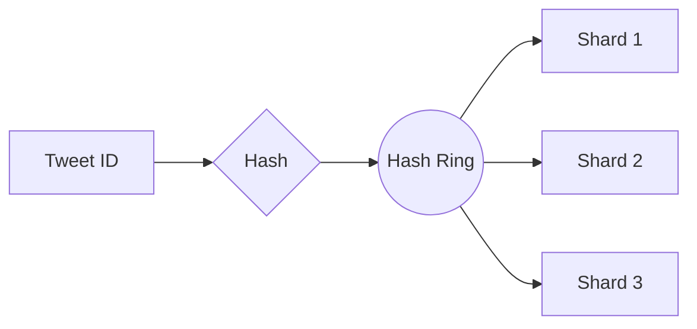
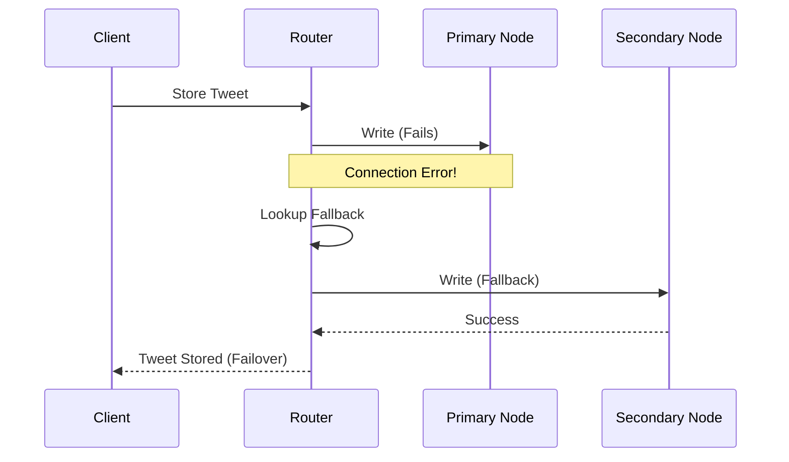

# Documentation: Failover, Replication, and Sharding

This document provides a technical overview of how this distributed system handles data sharding, replication, and failover across multiple nodes and laptops.

## 1. Data Sharding: Consistent Hashing

The system uses **Consistent Hashing** to distribute tweets across a dynamic set of storage nodes.

### Algorithm: SHA-256 with Virtual Nodes
- **Virtual Nodes**: Each physical shard (e.g., `Shard1`) is mapped to multiple points (default: 3) on the hash ring. This ensures a more uniform distribution of data even with a small number of physical nodes.
- **Hash Function**: Uses `SHA-256` to map tweet IDs and node identifiers to a large integer space.
- **Node Selection**: 
    1. Calculate `hash(tweet_id)`.
    2. Find the first node on the ring whose hash is greater than or equal to the tweet's hash (moving clockwise).
    3. If no such node exists, wrap around to the first node on the ring.

## 2. Replication Strategy

The system implements a **Primary-Secondary** replication model with **Chain Replication** properties for fallback.

### Replication Logic
1. **Primary Write**: The router first attempts to write the tweet to the shard determined by the hash ring.
2. **Synchronous Replication**: After a successful primary write, the router attempts to replicate the data to a secondary node.
3. **Replica Selection**: The replica is chosen as the **next physical node** clockwise in the hash ring.
4. **Consistency**: The system currently aims for eventual consistency if a replica write fails, although it attempts to retry and failover immediately.

## 3. Failover Mechanism

The failover system ensures high availability for both Read and Write operations when nodes go offline.

### Health Monitoring
- **`NodeHealthMonitor`**: Runs a background thread that periodically pings all configured nodes via Thrift.
- **Status Tracking**: Updates a `NodeRegistry` with `online` or `offline` status.
- **Webhook Integration**: Notifies the frontend in real-time about node status changes.

### Write Failover
If a write to the primary node fails (e.g., node is down):
1. **Retry Detection**: The system catches the connection or RPC error.
2. **Fallback Search**: It identifies all available fallback nodes (next nodes in the ring).
3. **Redirection**: It attempts to write to the first available fallback node.
4. **Logging**: The event is recorded in the `EventLogger` and broadcast to the dashboard.

### Read Failover
If a read from the primary node fails:
1. **Retry Primary**: One immediate retry is attempted on the primary node.
2. **Fallback Read**: If retry fails, the router searches for the tweet on its replica node (the next one in the ring).
3. **Data Retrieval**: Returns the tweet from the replica if found.

## 4. Technical Stack
- **Communication Protocol**: Apache Thrift (Cross-language RPC).
- **Service Router**: Flask (Python) with Socket.IO for real-time monitoring.
- **Storage Nodes**: Custom Python storage service using Thrift.
